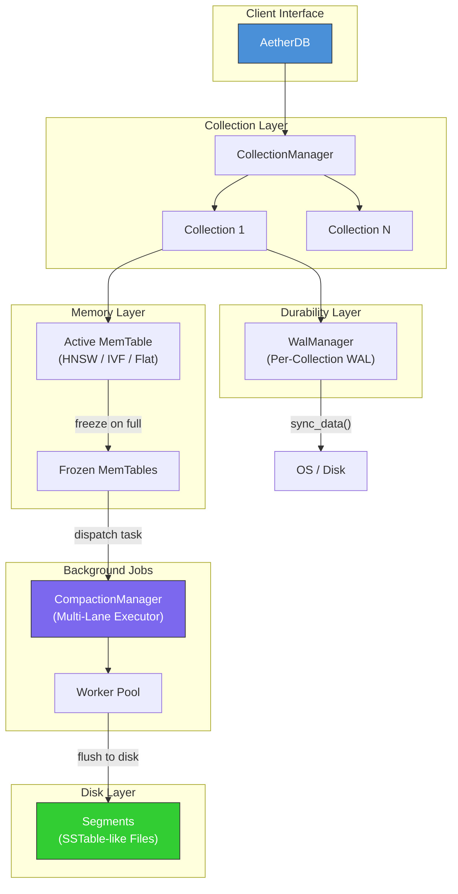

# AetherVec

<p align="center">
  <i>A high-performance, embedded vector database written in Rust.</i>
</p>

<p align="center">
  
  
  
</p>

---

## Overview

AetherVec is a lightweight, embeddable vector database designed for applications requiring fast approximate nearest neighbor (ANN) search. Built entirely in Rust, it emphasizes:

-   **High Performance**: LSM-tree inspired architecture optimized for writes.
-   **Durability**: Write-Ahead Logging (WAL) ensures data safety.
-   **Embeddable**: No separate server process required; link directly into your application.
-   **Pure Rust**: No external dependencies like a C runtime for core functionality.

---

## Architecture



---

## Core Components

| Component | Description |
| :--- | :--- |
| **`AetherDB`** | Main entry point. Manages database lifecycle and collection access. |
| **`Collection`** | A named namespace for vectors. Holds a MemTable and a list of frozen MemTables. |
| **`MemTable`** | In-memory index (Flat, HNSW, or IVF). Mutates on writes. |
| **`WalManager`** | Per-collection Write-Ahead Log for crash recovery. Uses `BufWriter` + `sync_data`. |
| **`CompactionManager`** | Background flush orchestrator using a **Multi-Lane Executor** model. Guarantees per-collection task ordering while allowing cross-collection parallelism. |

---

## Quick Start

```rust
use aethervec::{AetherDB, IndexConfig};

fn main() -> Result<(), Box<dyn std::error::Error>> {
    // 1. Open or create a database
    let db = AetherDB::new("./my_data")?;

    // 2. Create a collection with HNSW index
    let config = IndexConfig::new_with_default_config("hnsw")?;
    let collection = db.create_collection("my_vectors", 128, "cosine", config)?;

    // 3. Upsert a document
    let mut coll = collection.write().unwrap();
    coll.upsert(Document::new(vec![0.1; 128], "my-doc".to_string()))?;

    // 4. Search
    let results = coll.search(&vec![0.1; 128], 10);
    
    Ok(())
}
```

---

## Roadmap

### Done
-   [x] Core `AetherDB`, `Collection`, `Document` API
-   [x] Write-Ahead Log (WAL) with `sync_data`
-   [x] Multi-Lane Executor for background compaction (GPM-inspired)

### Phase 0: Observability
-   [ ] Compaction metrics: input/output bytes, records/sec, CPU cycles
-   [ ] Backlog metrics: L0 file count, pending jobs, stall events
-   [ ] mmap / page cache: major/minor page faults, readahead hit rate
-   [ ] Query latency: p50/p95/p99/p999, CPU vs I/O breakdown

### Phase 1: Memtable / Write Path
-   [ ] Memory arena (bump allocator) for memtable
-   [ ] Log-structured memtable (append-only records)
-   [ ] Thread-local arenas for maximum throughput
-   [ ] Move expensive fields (vector/content) out of hot index path

### Phase 2: Compaction Pipeline
-   [ ] Pipeline stages: Reader → Merge/Encode/Compress → Writer
-   [ ] CPU affinity (pin) for CPU-heavy stages
-   [ ] Isolate query cores from compaction
-   [ ] mmap + `madvise(SEQUENTIAL)` for input reads

### Phase 3: On-Disk ANN Index
-   [ ] On-disk Segment format (SSTable-like)
-   [ ] HNSW / IVF index implementation
-   [ ] mmap for immutable snapshots (read-only)
-   [ ] Page-aligned node records (4KB/8KB)
-   [ ] Graph reordering for locality
-   [ ] Upgrade to explicit batch I/O (`io_uring`) for p99/p999

### Phase 4: Scalability
-   [ ] Sharding (`ann_shard_i.db`)
-   [ ] Index-LSM: L0 (RAM delta) → L1 (small segments) → L2 (base snapshot)
-   [ ] RAM router for top-S shard selection

### Phase 5: Write-Heavy Optimization
-   [ ] Staleness SLO (e.g., 50ms for delta, minutes for base)
-   [ ] Adaptive degradation: delta size, query pruning, merge throttling

### Future
-   [ ] Server mode (gRPC / REST)

---

## Contributing

Contributions are welcome! Please open an issue or submit a pull request.

---

## License

MIT License. See [LICENSE](LICENSE) for details.
