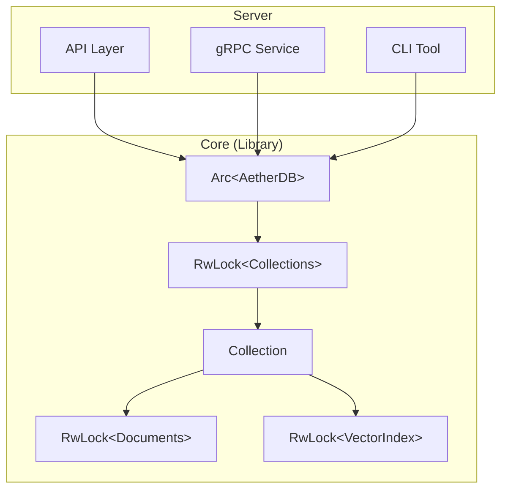

# AetherVec Core

This library serves as the high-cohesion storage engine for AetherVec. It handles all data management, indexing, and concurrency control, allowing the upper Server layer to remain simpler and stateless.

## Architecture

The architecture follows a clean separation between the interface layer (Server) and the storage engine (Core).

- **Server**: Handles network protocols (API, gRPC, CLI). It holds a shared reference (`Arc`) to the Core database instance.
- **Core**: Handles data storage, vector indexing, and concurrency safety.



### ASCII View

```
┌─────────────────────────────────────────────────────────┐
│                        Server                           │
│  ┌──────────┐  ┌──────────┐  ┌──────────┐              │
│  │   API    │  │   gRPC   │  │   CLI    │              │
│  └────┬─────┘  └────┬─────┘  └────┬─────┘              │
│       │             │             │                     │
│       └─────────────┼─────────────┘                     │
│                     │                                   │
│              Arc<AetherDB>                              │
└─────────────────────┼───────────────────────────────────┘
                      │
┌─────────────────────┼───────────────────────────────────┐
│                     ▼            Core                   │
│  ┌────────────────────────────────────────────────┐    │
│  │                  AetherDB                       │    │
│  │   ┌─────────────────────────────────────────┐  │    │
│  │   │    collections: RwLock<HashMap<...>>    │  │    │
│  │   └─────────────────────────────────────────┘  │    │
│  │                      │                          │    │
│  │   ┌──────────────────┼──────────────────────┐  │    │
│  │   │           Collection                     │  │    │
│  │   │    documents: RwLock<Vec<Document>>     │  │    │
│  │   │    index: RwLock<VectorIndex>           │  │    │
│  │   └─────────────────────────────────────────┘  │    │
│  └────────────────────────────────────────────────┘    │
└─────────────────────────────────────────────────────────┘
```

## Concurrency Design

Core is designed to be thread-safe internally. The Server does not need to manage locks.

1.  **Internal Locking**: `AetherDB` and `Collection` use internal `RwLock`s (or other synchronization primitives) to protect mutable state.
2.  **Shared Ownership**: The Server creates an instance of `AetherDB` (usually wrapped in `Arc`) and shares it across multiple request handlers.

## Instance Isolation & Persistence

The behavior of AetherVec instances depends on the initialization mode:

### 1. In-Memory Mode
Initialized via `AetherDB::new()`.

-   **Semantics**: Every instance is completely **isolated**.
-   **Behavior**:
    ```rust
    let db1 = AetherDB::new();
    let db2 = AetherDB::new();
    // db1 and db2 share NOTHING. They are separate memory spaces.
    ```
-   **Concurrency**: Thread-safe within the instance (via `Arc<AetherDB>`), but separate instances are unrelated.

### 2. Persistent Mode (Disk-Based)
Initialized via `AetherDB::open("/path/to/data")`.

-   **Semantics**: The **Path** defines the database identity.
    -   Multiple handles to the same path (in the same process) *could* conceptually share data, but typically in embedded designs, one process holds one active handle.
-   **Process Concurrency (File Locking)**:
    -   To prevent data corruption, AetherVec uses **OS-level File Locking** (e.g., `flock` on Unix) on a `LOCK` file within the database directory.
    -   **Rule**: Only **one process** can open a specific database path at a time.
    -   **Behavior**:
        ```rust
        // Process A
        let db = AetherDB::open("/var/lib/aether"); // Success, acquires lock

        // Process B
        let db = AetherDB::open("/var/lib/aether"); // Fails immediately with "Database Locked"
        ```
    -   This eliminates the need for a global singleton daemon or complex IPC. The filesystem serves as the source of truth for "who owns the database".
